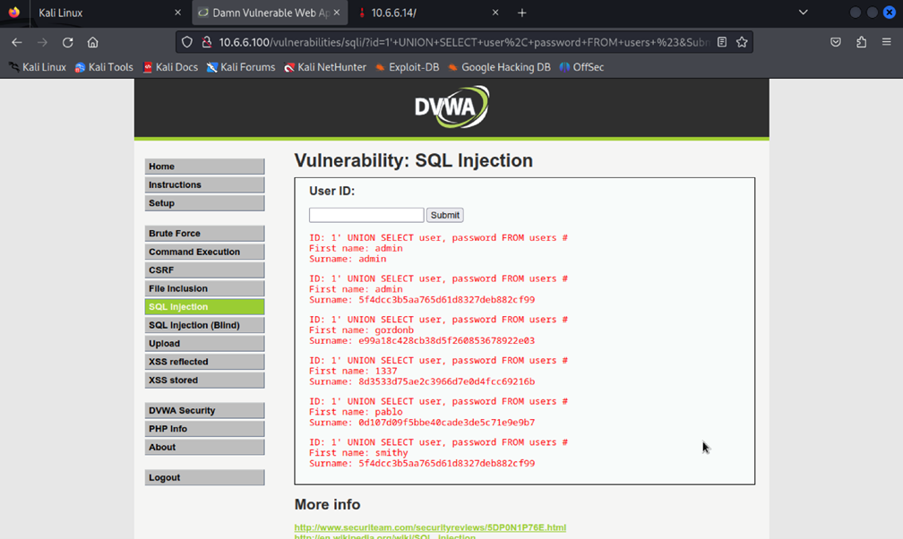
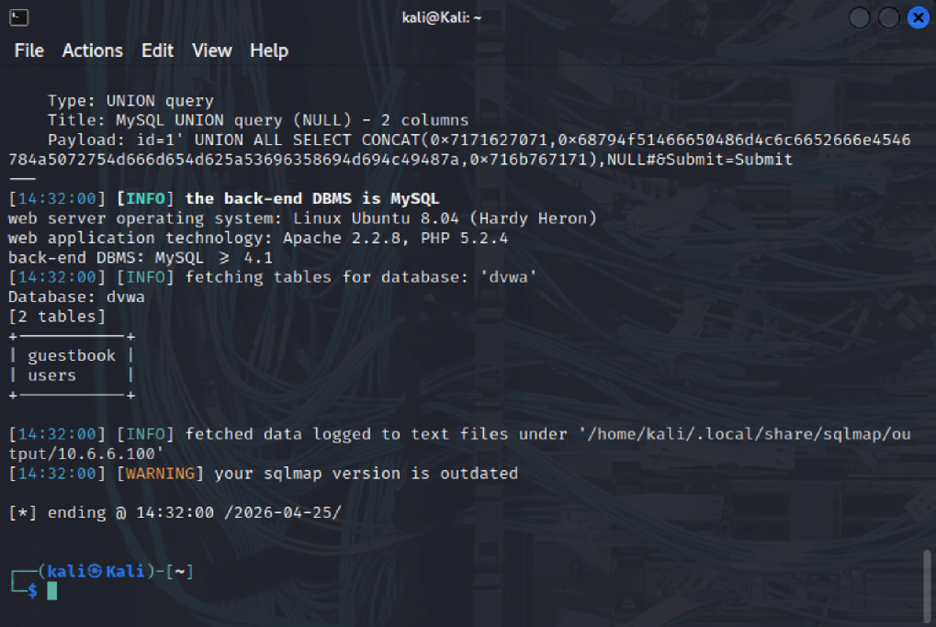
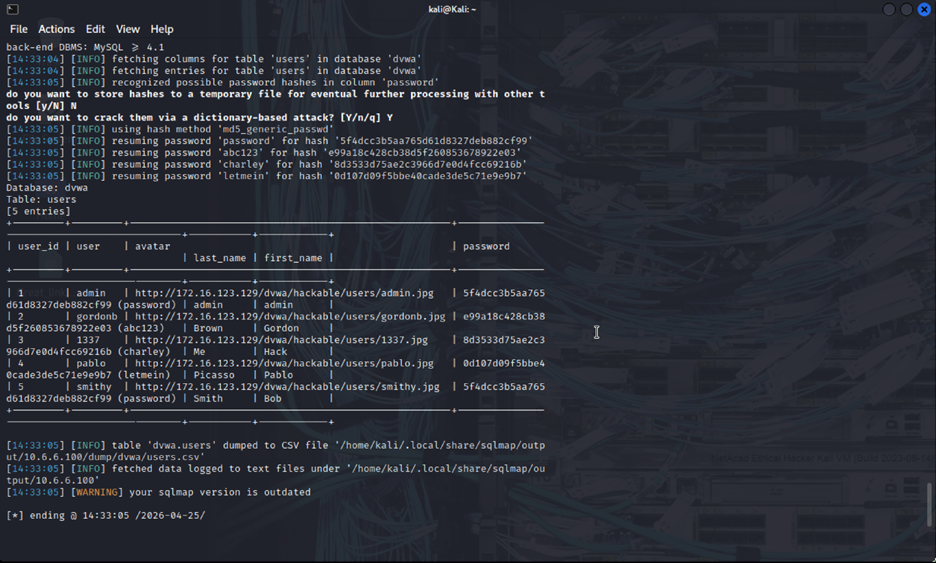
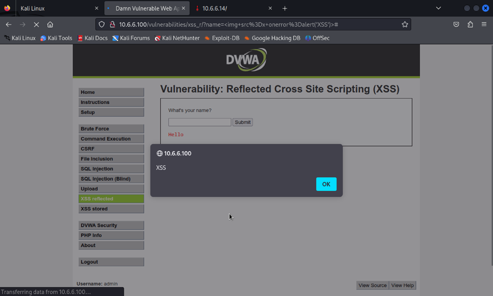
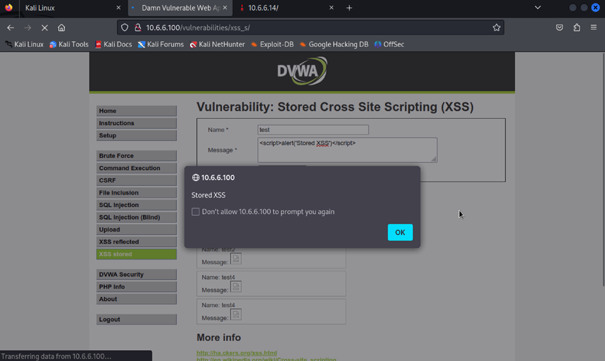

# Web Application Security Assessment (DVWA Lab)

## Overview

This project demonstrates a structured security assessment conducted on a deliberately vulnerable web application (DVWA) in a controlled lab environment.

The objective was to identify common web vulnerabilities, understand their impact, and demonstrate practical exploitation techniques along with secure mitigation strategies.

---

## Objectives

* Identify common web application vulnerabilities
* Perform controlled security testing
* Analyze system weaknesses
* Apply secure coding and defense principles

---

## Scope

All testing was performed in a local, controlled environment using DVWA (Damn Vulnerable Web Application).

No real systems or unauthorized targets were involved.

---

## Vulnerabilities Explored

### 1. SQL Injection (SQLi)

* Tested login forms and input fields
* Demonstrated authentication bypass using crafted inputs
* Extracted sensitive database information using manual and automated techniques

📸 Example (Data Extraction via SQL Injection):

---

### 2. Automated Exploitation (sqlmap)

* Identified backend DBMS (MySQL)
* Enumerated available databases
* Extracted tables and user credentials

📸 Database Enumeration:

📸 Extracted Users Table:

---

### 3. Cross-Site Scripting (XSS)

#### Reflected XSS
* Injected JavaScript payloads into input fields
* Demonstrated real-time script execution in browser

📸 Reflected XSS:

#### Stored XSS
* Stored malicious scripts in the application database
* Demonstrated persistent execution affecting multiple users

📸 Stored XSS:

---

### 4. Input Validation Weaknesses

* Tested how the application handles unexpected input
* Identified lack of validation and sanitization across multiple endpoints

---

## Tools Used

* Kali Linux
* DVWA (Damn Vulnerable Web Application)
* Burp Suite (request interception and analysis)
* sqlmap (automated SQL injection testing)
* Browser Developer Tools

---

## Key Findings

* Lack of input validation allows injection attacks
* Absence of prepared statements exposes database queries
* Client-side inputs are not sanitized properly
* Sensitive data can be extracted through SQL injection
* Session-related vulnerabilities can be exploited via XSS

---

## Security Recommendations

* Use prepared statements and parameterized queries
* Implement strict input validation and sanitization
* Apply proper session management techniques
* Enforce authentication and authorization checks
* Use output encoding to prevent XSS

---

## Key Learnings

* Practical understanding of OWASP Top 10 vulnerabilities
* Hands-on experience with penetration testing tools
* Importance of secure coding practices
* Real-world impact of insecure web applications

---

## Disclaimer

This project was conducted strictly for educational purposes in a controlled environment.

No unauthorized systems were targeted.
